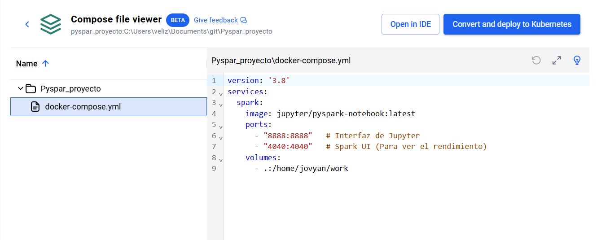
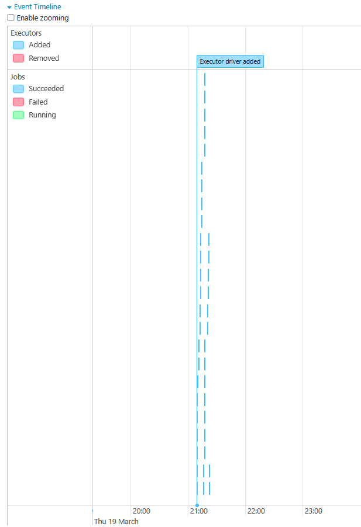
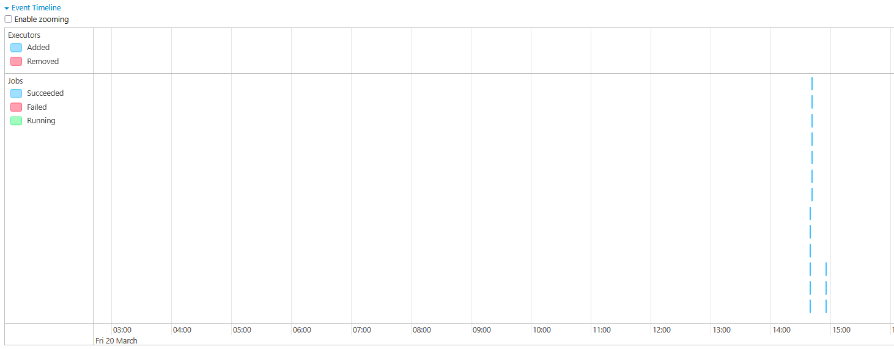

# Telco Churn Analysis con PySpark


Proyecto de análisis de fuga de clientes (churn) usando PySpark, corriendo todo dentro de Docker. Trabajo con un dataset real de una empresa de telecomunicaciones: limpio los datos, encuentro los problemas que trae el CSV y saco conclusiones que le sirven al negocio.

---

## ¿De qué va esto?

Quería aprender Spark de verdad, no solo copiar queries de un tutorial. Así que agarré un dataset real, lo metí en un entorno Docker con Spark y Jupyter, y empecé a trabajarlo como si fuera un proyecto laboral.

En el camino me encontré con cosas que los tutoriales no te muestran: datos sucios, columnas con tipos incorrectos, valores vacíos disfrazados de nulos, y un par de lecciones sobre rendimiento que aprendí probando directamente en la Spark UI.

Este README documenta todo eso — lo que funcionó y cómo lo resolví.

---

## Estructura del proyecto

```
telco-churn-pyspark/
│
├── Data/
│   └── clientes.csv                  # Dataset fuente (7,043 registros)
│
├── img/
│   ├── dokers.png                    # Entorno Docker levantado y corriendo
│   ├── redimiento-mal.png            # Spark UI antes del caching
│   └── redimiento-mej.png            # Spark UI después del caching
│
├── notebook/
│   └── spark_clean_analytics.ipynb   # Todo el análisis acá
│
├── src/
│   └── .gitkeep                      # Para scripts cuando migre a producción
│
├── docker-compose.yml
└── README.md
```

---

## Qué usé

| Herramienta | Para qué |
|---|---|
| Apache Spark 3.x + PySpark | Procesar y analizar los datos |
| Docker + Docker Compose | Levantar el entorno sin instalar nada a mano |
| Jupyter Lab | Escribir y probar el código |
| Python 3.10+ | Todo el análisis |

---

## El entorno — por qué Docker

Una de las cosas que más complica arrancar con Spark es la instalación: Java, Scala, variables de entorno... Con Docker eso desaparece. Cualquiera que clone este repo lo levanta con un comando y listo.

```yaml
services:
  spark-master:
    image: cluster-pyspark-ready
    ports:
      - "8888:8888"   # Jupyter Lab
      - "4040:4040"   # Spark UI para ver los jobs
    volumes:
      - ./work:/home/jovyan/work
```

```bash
docker-compose up -d
```



---

## El problema que me encontré con los datos

La columna `cargo_total` venía como texto (`string`) y los clientes nuevos tenían un espacio vacío `" "` en lugar de un nulo real. Spark no los detecta automáticamente, así que tuve que buscarlos a mano.

```python
# Buscar nulos reales y los que están disfrazados como espacios
df.select([
    F.count(F.when(F.col(c).isNull() | (F.col(c) == " "), c)).alias(c)
    for c in df.columns
]).show()
```

Encontré 11 registros así, todos en `cargo_total`. La solución fue convertir la columna a `double` (los espacios se vuelven `null` solos) y rellenar esos nulos con `cargo_mensual`, que tiene sentido para clientes que recién entraron.

```python
df = df.withColumn("cargo_total", F.col("cargo_total").cast("double"))

df = df.withColumn("cargo_total",
    F.when(F.col("cargo_total").isNull(), F.col("cargo_mensual"))
     .otherwise(F.col("cargo_total"))
)
```

---

## Lo que aprendí con `.cache()`

En un momento del análisis notaba que ciertas operaciones tardaban más de lo esperado. Probé agregar `.cache()` para ver qué pasaba — básicamente le dices a Spark que guarde el DataFrame en memoria en lugar de recalcularlo desde cero cada vez.

**Sin cache** — Spark recalcula todo desde el origen en cada acción:



**Con cache** — lo guarda en memoria y los jobs siguientes van mucho más rápido:



Fue una prueba para entender cómo funciona el motor por dentro, no una optimización de producción. Pero me ayudó a entender por qué en proyectos grandes esto importa bastante.

---

## Qué encontré en los datos

### Los contratos mensuales son el mayor problema de retención

```python
df.groupBy("tipo_contrato").agg(
    F.count("*").alias("clientes"),
    F.round(F.mean("fuga_cliente") * 100, 1).alias("tasa_fuga_pct"),
    F.round(F.mean("cargo_mensual"), 2).alias("cargo_prom")
).orderBy("tasa_fuga_pct", ascending=False).show()
```

| Tipo de contrato | Clientes | Tasa de fuga |
|---|---|---|
| Mensual | 3,875 | ~43% |
| Anual | 1,473 | ~11% |
| Bianual | 1,695 | ~3% |

Un cliente con contrato mensual tiene **14 veces más chances de irse** que uno con contrato de dos años. Si la empresa quiere retener clientes, empezar por acá tiene mucho sentido.

### Cuánto vale un cliente antes de irse

```python
# LTV = cuánto pagó en total durante su tiempo como cliente
df = df.withColumn("ltv",
    F.round(F.col("cargo_mensual") * F.col("meses_antiguedad"), 2)
)

df.groupBy("fuga_cliente").agg(
    F.round(F.sum("cargo_mensual"), 0).alias("revenue_mensual_en_riesgo"),
    F.round(F.avg("ltv"), 0).alias("ltv_promedio"),
    F.round(F.avg("meses_antiguedad"), 1).alias("meses_promedio")
).show()
```

### Segmentar clientes por riesgo

```python
df_seg = df.withColumn("segmento",
    F.when(
        (F.col("meses_antiguedad") >= 24) & (F.col("cargo_mensual") >= 60),
        "VIP — alto valor"
    )
    .when(F.col("meses_antiguedad") < 6, "Nuevo — riesgo alto")
    .when(
        (F.col("meses_antiguedad") >= 6) & (F.col("cargo_mensual") < 40),
        "Maduro — bajo valor"
    )
    .otherwise("Medio")
)
```

### Otros análisis que están en el notebook

- Qué método de pago tiene más fuga (spoiler: el cheque electrónico)
- Si los adultos mayores se comportan distinto al resto
- En qué mes de vida del cliente la fuga es más alta
- Qué servicios adicionales hacen que la gente se quede más

---

## Conclusiones principales

- **Los primeros 6 meses son los más críticos.** Después de ese punto la fuga baja bastante. Tiene más sentido invertir en el onboarding que en recuperar clientes que ya llevan años.
- **Los servicios adicionales ayudan a retener.** Los clientes con soporte técnico o seguridad online se van menos.
- **El cheque electrónico es una señal de alerta.** Tiene la tasa de fuga más alta de todos los métodos de pago.

---

## Cómo correrlo

```bash
# Clonar el repo
git clone https://github.com/Frank-Data/telco-churn-pyspark.git
cd telco-churn-pyspark

# Levantar todo con Docker
docker-compose up -d

# Abrir Jupyter en el navegador
# → http://localhost:8888

# Ver cómo corren los jobs de Spark
# → http://localhost:4040
```

---


---

**Frank** — Estudiante de Arquitectura de Datos en Cibertec
